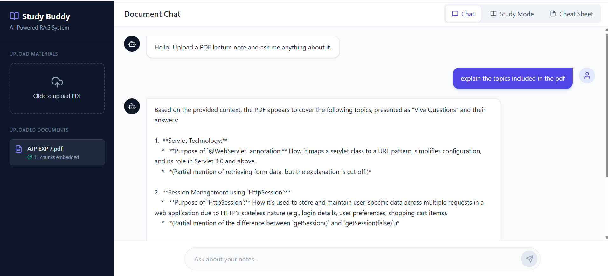
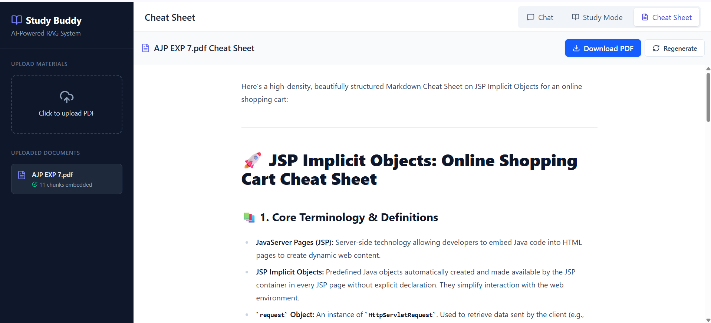

# 📘 AI Study Buddy — Full-Stack AI-Powered RAG System

[](https://react.dev/)
[](https://nodejs.org/)

[](https://tailwindcss.com/)
[](https://render.com/)

An advanced, responsive full-stack **Retrieval-Augmented Generation (RAG)** application designed to transform static study materials into dynamic, interactive learning environments. Users can upload educational PDFs and immediately unlock context-aware chat interfaces, comprehensive structured summaries, and optimized quick-reference cheat sheets generated natively by LLMs.

🚀 **Live Interactive Demo:** [https://study-buddy-ui-bfuf.onrender.com/](https://study-buddy-ui-bfuf.onrender.com/)

---

## 📸 Product Preview

<table width="100%">
  <tr>
    <td width="50%" align="center">
      <h3>🏠 Interactive User Dashboard</h3>
      
    </td>
    <td width="50%" align="center">
      <h3>📝 Dynamic Cheat Sheet Compilation</h3>
      
    </td>
  </tr>
  <tr>
    <td width="50%" align="center">
      <h3>🧠 Context-Aware Study Session (View 1)</h3>
      
    </td>
    <td width="50%" align="center">
      <h3>💬 Interactive Knowledge Testing (View 2)</h3>
      
    </td>
  </tr>
</table>

---

## ✨ Core Features

*   📂 **Robust PDF Ingestion Pipeline:** Seamless drag-and-drop document uploads coupled with real-time text parsing and token-optimized chunking matrices.
*   💬 **Context-Aware Document Chat:** Deep semantic document interrogation using custom text-splitting heuristics to fetch precise source contexts for the Gemini AI architecture.
*   🧠 **Structured Study Assistant Mode:** Instantly converts dry technical textbooks or slide decks into clean, thematic interactive learning outlines.
*   📝 **Dynamic Cheat Sheet Compilation:** Auto-extracts critical formulas, foundational definitions, and core concepts into a scannable dashboard.

---

## 🛠️ Tech Stack & Architecture

### Frontend (User Interface)
*   **React 18 & Vite:** Ultra-fast, component-driven client architecture optimized for rapid single-page updates.
*   **Tailwind CSS:** Fully tailored layout utilities providing a responsive, dark-mode-first aesthetic dashboard.
*   **Context API:** Client-side state orchestration handling dynamic route references, processing spinners, and persistent dialogue histories.

### Backend (API Gateway & Engine)
*   **Node.js & Express:** Production-scale server runtime routing asynchronous network requests across localized controller groups.
*   **Retrieval-Augmented Generation (RAG):** Custom structural token segmentation mechanics slicing material strings before injecting matching reference payloads.
*   **Google Gemini Pro Integration:** Direct orchestration layer interacting natively with Google’s generative AI ecosystem via structured environment variable masks.

---

## 🗂️ Repository Structure

```text
AI-Study-Buddy/
├── assets/               # Production screenshots and media assets
├── frontend/             # React/Vite Client UI Application
│   ├── src/
│   │   ├── components/   # Modular, re-usable dashboard elements
│   │   ├── App.jsx       # Root framework router and state initialization
│   │   └── main.jsx
│   └── package.json
│
├── backend/              # Node.js REST API Architecture
│   ├── routes/           # Express router declarations (/api/upload, etc.)
│   ├── services/         # Generative AI pipeline and orchestration services
│   ├── utils/            # Document parsing and intelligent text-splitters
│   ├── server.js         # Server initialization, CORS tuning, and boot configs
│   └── package.json
│
└── render.yaml           # Automated Blueprint Infrastructure Schema
```
---

## 👩‍💻 About the Developer

### Pujitha Mamidishetty
**B.Tech Data Science Student | Full-Stack Developer | AI & ML Enthusiast**

I am a passionate engineering student with a strong interest in building intelligent software systems that combine modern web technologies with Artificial Intelligence. My experience spans Full-Stack Development, Data Science, Machine Learning, and AI-powered applications, with a focus on creating impactful, user-centric solutions.

Throughout my academic journey, I have maintained a strong academic record while actively participating in hackathons, technical communities, and software development projects that solve real-world problems.

### 🏆 Achievements & Leadership

- 🎯 Maintained a **CGPA of 9.0+** throughout engineering.
- 🚀 Selected in the **Smart India Hackathon (SIH) 2024** internal university pool.
- 💡 Shortlisted for **Round 2 of Mumbai Hacks**.
- 🛍️ Participant in **Flipkart Runway**.
- 👥 Served as **Logistics Head of ACM Council**, organizing technical events and community initiatives.
- 💻 Built multiple projects across AI, Machine Learning, Computer Vision, and Full-Stack Development.

### 🛠️ Technical Skills

#### Programming Languages
- Java
- Python
- JavaScript
- SQL

#### Frontend Development
- React.js
- Vite
- Tailwind CSS
- HTML5
- CSS3

#### Backend Development
- Node.js
- Express.js
- REST APIs

#### Data Science & AI
- Machine Learning
- Deep Learning
- Natural Language Processing (NLP)
- Retrieval-Augmented Generation (RAG)
- Google Gemini API
- Data Analysis

#### Databases & Tools
- MySQL
- Git
- GitHub
- Postman
- Render
- Vercel

### 🌟 Areas of Interest

- Artificial Intelligence & Machine Learning
- Full-Stack Web Development
- Generative AI Applications
- Data Science & Analytics
- Computer Vision
- Software Engineering

### 🌐 Connect With Me

[](https://github.com/Pujitha1809)

[](https://www.linkedin.com/in/pujitha-mamidishetty/)

[](https://pujitha-portfolio-rust.vercel.app/)
